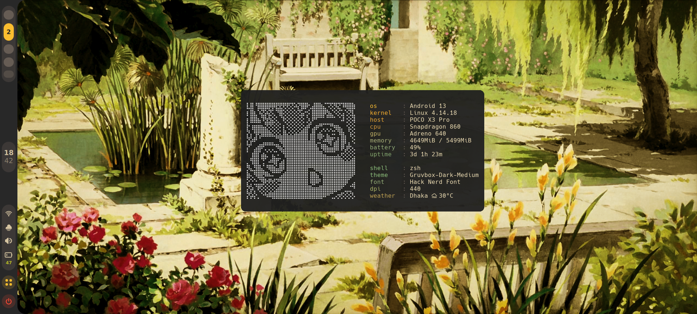
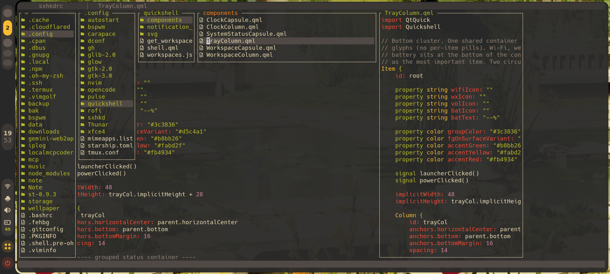

# bspwm dots

my dotfiles for bspwm running on android through termux + termux:x11




## what's in here

- **bspwm** 0.9.12, config is in `.config/bspwm/bspwmrc` (ported from my old i3 config)
- **sxhkd** for keybinds, `.config/sxhkd/sxhkdrc`
- **quickshell** sidebar on the left (workspaces, clock, wifi, weather, volume, battery, power button), `.config/quickshell/`
- **st** 0.9.3 terminal, source and build in `st-0.9.3/`
- **rofi** as the app launcher
- **zsh** with starship prompt
- **neovim** config
- wallpapers in `wellpaper/`, feh loads `default.png` on start
- `fetch`, a little fetch script i wrote for termux (ascii art, battery, weather, stuff like that)

## starting the session

run this from termux:

```sh
sh ~/dots/start.sh
```

it kills any old termux-x11 process, starts pulseaudio, starts the x11 server on `:0`, opens the termux:x11 app, then launches bspwm.

## stuff to know

- you need termux, termux:x11, termux:api (the fetch uses it for battery), plus `pulseaudio`, `feh`, `xcompmgr`, `jq`, `curl`
- the config is for bspwm **0.9.12**. settings from 0.10 guides like `focus_new` or per-side gaps don't exist and will just error out
- `left_padding 48` in bspwmrc is there to make room for the quickshell bar. 0.9.12 ignores `_NET_WM_STRUT_PARTIAL` so without it windows would tile under the bar
- borders are off (`border_width 0`), rounded corners come from `border_radius 20` + xcompmgr

